# 作业2报告：气泡地图（Bubble Map）分析与改进

## 1. 所选可视化的URL

原始作品来自D3 Gallery，作品名称为 **“Estimated population by county, 2016”**（气泡地图）。  
原始代码参考：[Observable – Bubble Map]https://observablehq.com/@d3/bubble-map/2 （原始版本无交互筛选与缩放，仅静态气泡+悬停提示）。  

## 2. 视觉惯用语分析（Visual Idiom）

| 分析项 | 原始作品 | 改进后作品（基于用户代码） |
|--------|----------|----------------------------|
| **视觉成语名称** | 比例符号地图（Proportional Symbol Map） / 气泡地图 | 交互式比例符号地图，增强版气泡地图 |
| **标记（Marks）** | 圆形（circle） | 圆形（canvas arc） |
| **视觉变量（Visual Variables）** | 位置（经度/纬度投影）、面积（√人口）、颜色（固定棕色）、边框（白色） | 位置、面积（√人口）、颜色（对数色标YlOrRd）、边框（交互态红色）、透明度（联动过滤） |
| **交互技术（Interaction）** | 仅悬停显示tooltip | 悬停高亮 + 详细tooltip、缩放/平移（zoom）、州筛选下拉菜单、人口范围刷选（brush）、图例联动、视口自适应 |
| **数据结构（Data Structure）** | 表：县FIPS、人口 + 地理空间拓扑（TopoJSON） | 同左，但预处理了人口映射和质心坐标 |
| **分析任务（Tasks）** | 观察人口空间分布、比较各县人口规模 | 同左，并支持：按州聚焦分析、按人口区间筛选、多尺度探索（缩放）、快速定位高/低人口区域 |
| **可扩展性（Scalability）** | 中低（约3000个圆，密集区域重叠严重，无剔除） | 高（视口剔除 + 双Canvas渲染，支持高分辨率缩放，流畅展示全部县） |

## 3. 感知原则分析（Perceptual Principles）

### 3.1 前注意特征（Pre-attentive Features）

| 原始问题 | 改进方案 |
|----------|----------|
| 仅靠**圆面积**差异表达人口，虽能被前注意感知，但在密集重叠区面积对比被破坏，难以快速识别大小关系。 | 保留面积前注意优势，同时增加**颜色亮度**（黄→红渐变）作为补充前注意通道，使高人口区域更突出；**悬停时红色描边**也利用了颜色/形状的前注意弹出效果。 |
| 无任何引导用户注意的视觉线索。 | 通过**人口范围刷选**，符合范围的气泡保持较高透明度，不符合者淡化，符合范围的气泡群体形成“前注意分组”，用户可快速感知哪些县处于选定区间。 |

### 3.2 颜色使用（Color Usage）

| 原始问题 | 改进方案 |
|----------|----------|
| 所有气泡使用单一的**棕色**，无法区分人口量级，且未考虑色盲人群。 | 采用**对数色标（d3.scaleSequentialLog）**，插值器 `d3.interpolateYlOrRd`（黄-橙-红）。该色标对红色-绿色色盲相对友好（亮度变化显著），并辅以**透明度**编码（筛选/非筛选状态），增强可读性。 |
| 颜色无意义，仅装饰。 | 颜色与人口对数正相关，符合“越红人口越多”的直观隐喻。 |

### 3.3 格式塔分组定律（Gestalt Laws）

| 原理 | 原始作品应用 | 改进作品应用 |
|------|--------------|--------------|
| **邻近性** | 圆形按地理空间位置排列，天然利用邻近性形成州/区域分组。 | 同左，并增加**州筛选**后自动聚焦到该州，强化邻近分组的感知。 |
| **相似性** | 所有圆颜色、大小规则一致，但无额外分组线索。 | 通过**刷选**使符合人口范围的气泡保持高亮（高透明度），不符合者变淡，形成“相似组”对比。 |
| **闭合性/连通性** | 未使用。 | 未使用（地图场景下不适用）。 |
| **共同命运** | 无动画或联动。 | 缩放/平移时所有气泡同步运动；筛选州时地图平滑缩放，体现共同命运，帮助用户理解视图变化。 |

## 4. 改进建议与实现方案

### 4.1 原始作品存在的问题

原始气泡地图存在以下 6 个主要问题：
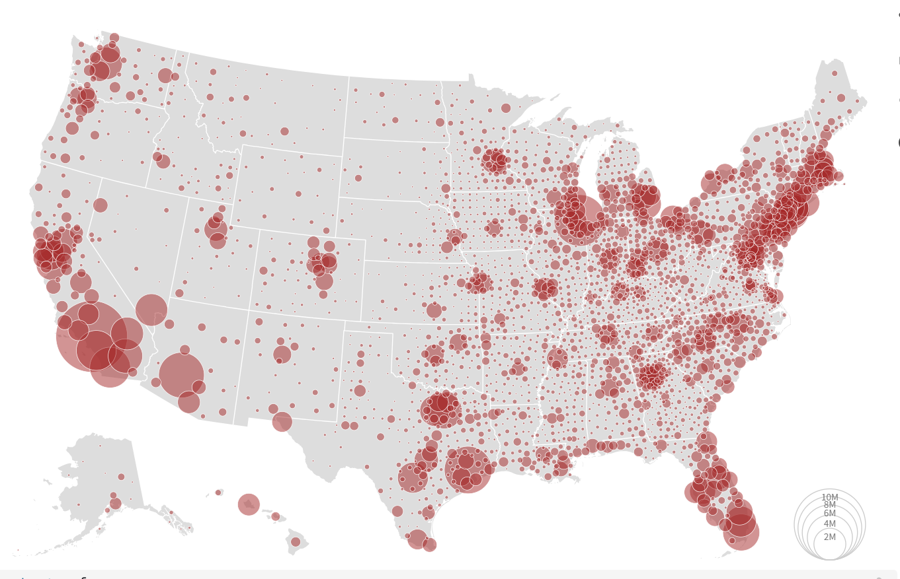
1. **交互能力薄弱**  
   仅提供最基本的悬停提示（tooltip），不支持筛选或聚焦。  
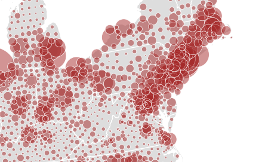  

2. **颜色编码缺失**  
   所有气泡使用单一棕色填充，无法通过颜色区分人口量级，用户只能依赖气泡面积（且在重叠区面积比较困难）。  
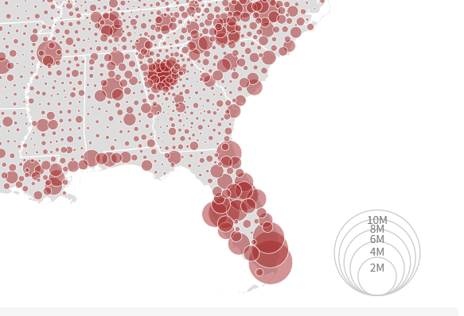  

3. **前注意特征利用不足**  
   没有高亮、淡化、边框变化等引导注意的线索，用户必须逐个悬停才能获取信息，认知负荷高。  
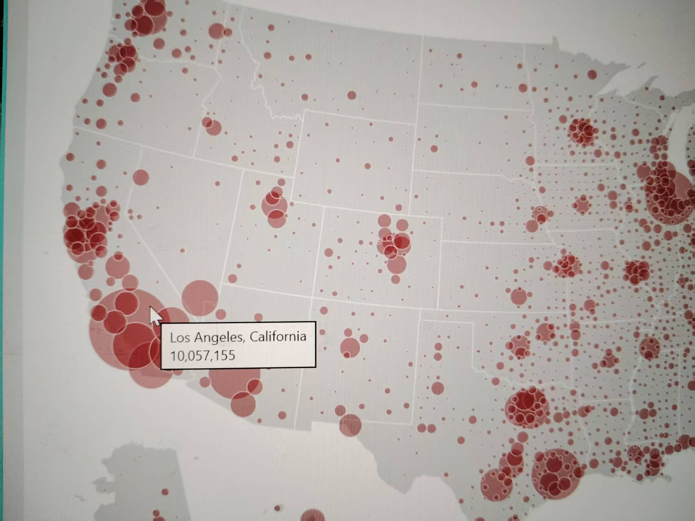  

4. **可访问性差**  
   未考虑色盲人群，棕色在红绿色盲或蓝黄色盲眼中辨识度很低，且无法传递数据差异。 
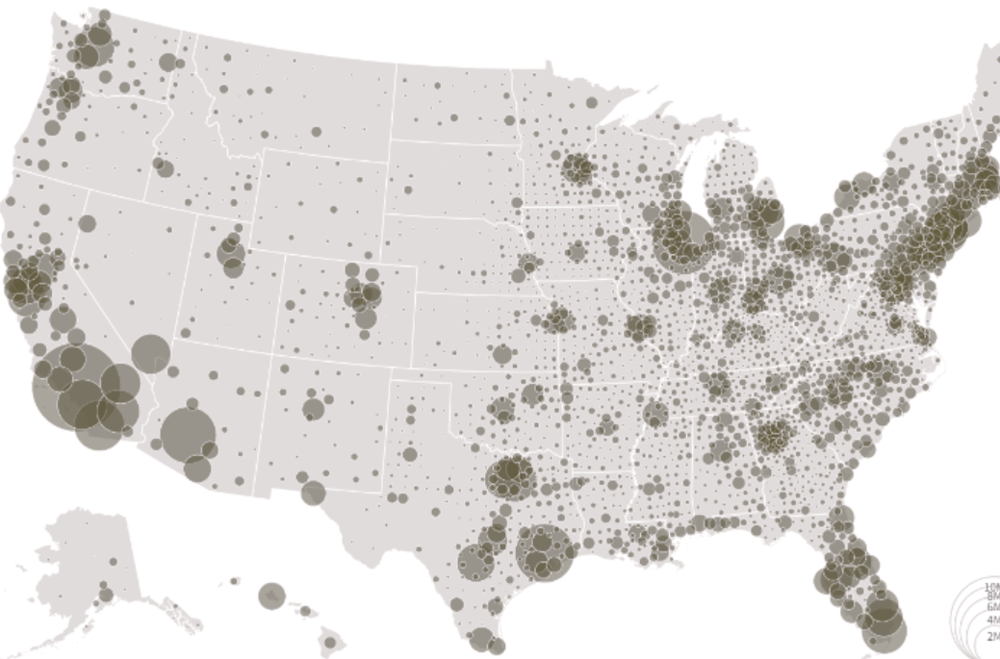

 

5. **无数据过滤能力**  
   无法按州筛选，也无法按人口范围过滤，分析任务局限于“全局浏览”，难以回答“哪些州人口密度高”“哪些县人口在 10 万以上”等问题。  仅有一张静态地图。
  

---

### 4.2 改进方案（已用 D3.js v5 实现）

针对上述 6 个问题，我们逐一实施以下改进，并在代码中对应实现：

#### 问题1：交互能力薄弱 → 增加缩放/平移 + 州自动聚焦

- **改进措施**：实现 `d3.zoom` 行为，支持鼠标滚轮缩放、拖拽平移；选择州后平滑缩放至该州边界范围。  
- **代码模块**：`app.js` 中 `zoom` 绑定，`map.js` 中 `getStateBounds()` 计算州边界。  
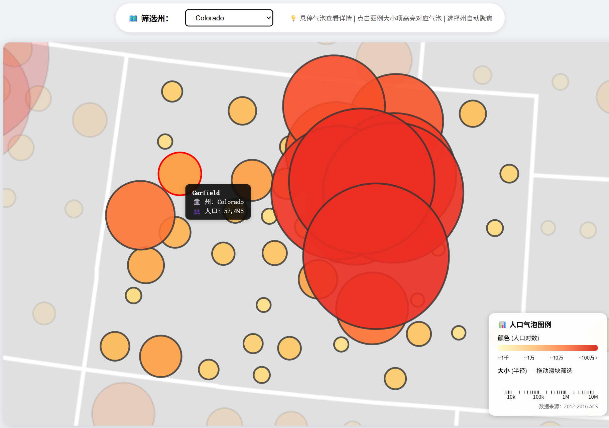

#### 🎨 问题2：颜色编码缺失 → 引入对数颜色映射（YlOrRd）

- **改进措施**：使用 `d3.scaleSequentialLog()` 和插值器 `d3.interpolateYlOrRd`，人口越高的县颜色越红（接近深红），人口越低的县颜色越黄（接近浅黄）。  
- **代码模块**：`bubbles.js` 中的 `colorScale` 定义。  
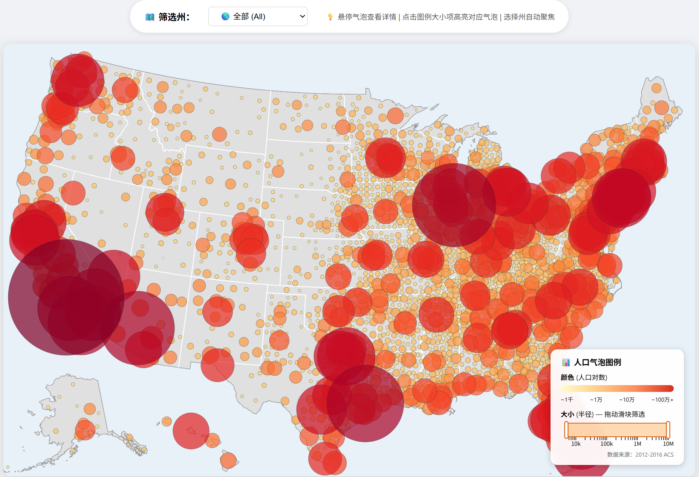

#### 👁️ 问题3：前注意特征利用不足 → 范围高亮 + 悬停红边 + 州筛选淡化

- **改进措施**：  
  - 人口刷选：符合人口范围的气泡保持正常透明度（0.7~0.9），不符合者透明度降至 0.1~0.2，形成前注意分组。  
  - 悬停时气泡增加红色描边（stroke: #f00, width: 2.5px），并提升绘制层级。  
  - 州筛选时，非目标州的气泡整体淡化，目标州保持高亮。  
- **代码模块**：`bubbles.js` 的 `draw()` 函数中根据 `activePopRange` 和 `selectedState` 动态设置 `globalAlpha` 和 `strokeStyle`。  
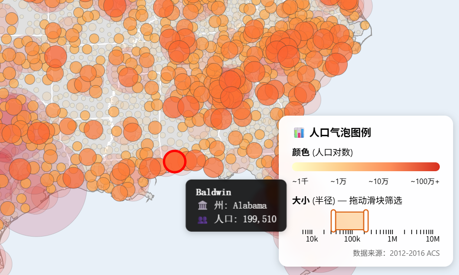

#### ♿ 问题4：可访问性差 → 色盲友好色标

- **改进措施**：YlOrRd 色标在红绿色盲、蓝黄色盲下亮度差异显著，不依赖红绿对立；同时利用透明度辅助区分状态。  
- **代码模块**：色标固定为 `interpolateYlOrRd`，未使用红/绿对立色。  
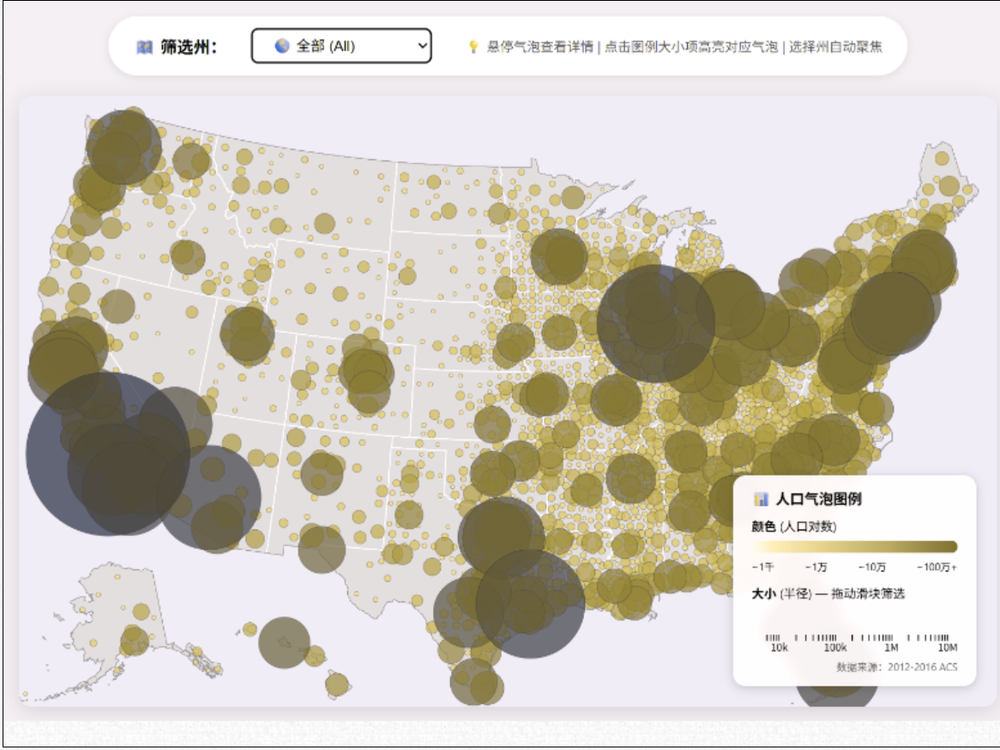

#### ⚡ 问题5：性能差 → 视口剔除 + 双Canvas离屏缓存

- **改进措施**：  
  - 视口剔除（Viewport Culling）：`bubbles.js` 绘制前判断每个气泡的包围盒是否与当前视口相交，不相交则跳过。  
  - 双Canvas分层：底图（州界、县界）预先渲染到 `offscreenCanvas`，缩放/平移时仅做贴图变换；气泡层独立重绘。  
- **代码模块**：`bubbles.js` `draw()` 中的边界判断；`map.js` 中 `offscreenCanvas` 预渲染。  
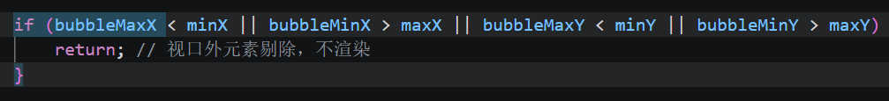

#### 🧹 问题6：无数据过滤能力 → 州下拉菜单 + 人口范围刷选（D3 Brush）

- **改进措施**：  
  - 州筛选：通过 `ui.js` 动态生成州列表，选择后更新 `selectedState` 并重绘。  
  - 人口范围刷选：在图例区添加 D3 Brush 滑条，用户拖拽选择人口区间，实时更新 `activePopRange` 并过滤气泡。  
- **代码模块**：`ui.js` 的 `populateStateSelect()`；`app.js` 中的 `brush` 事件处理。 
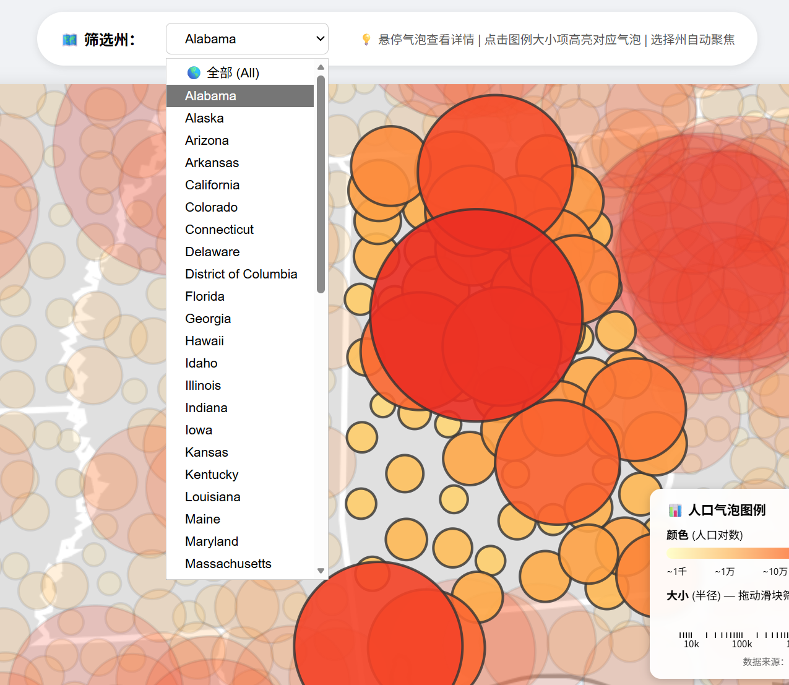 
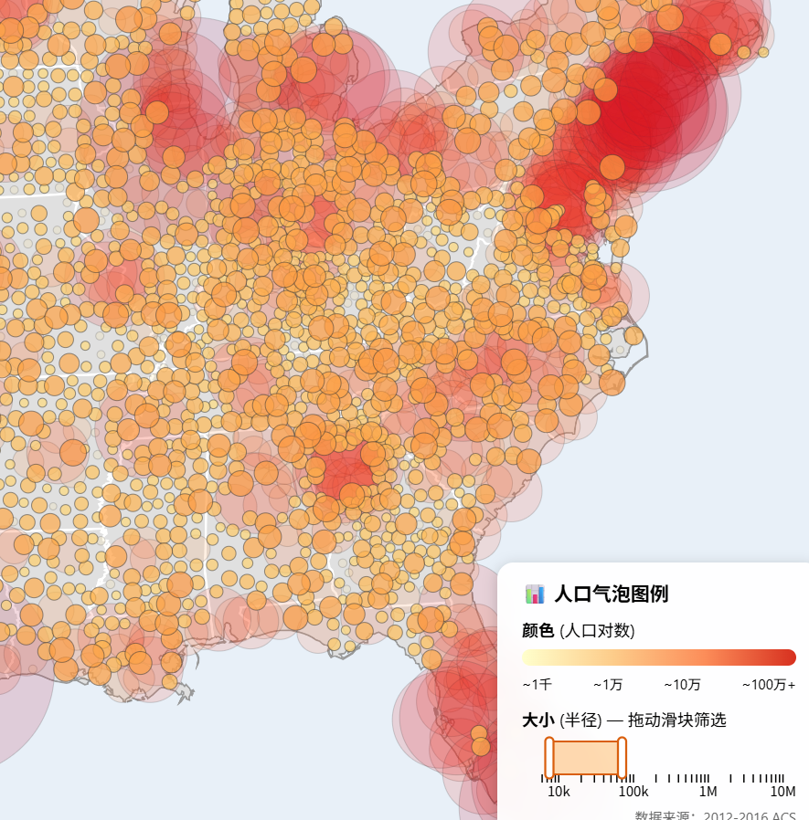
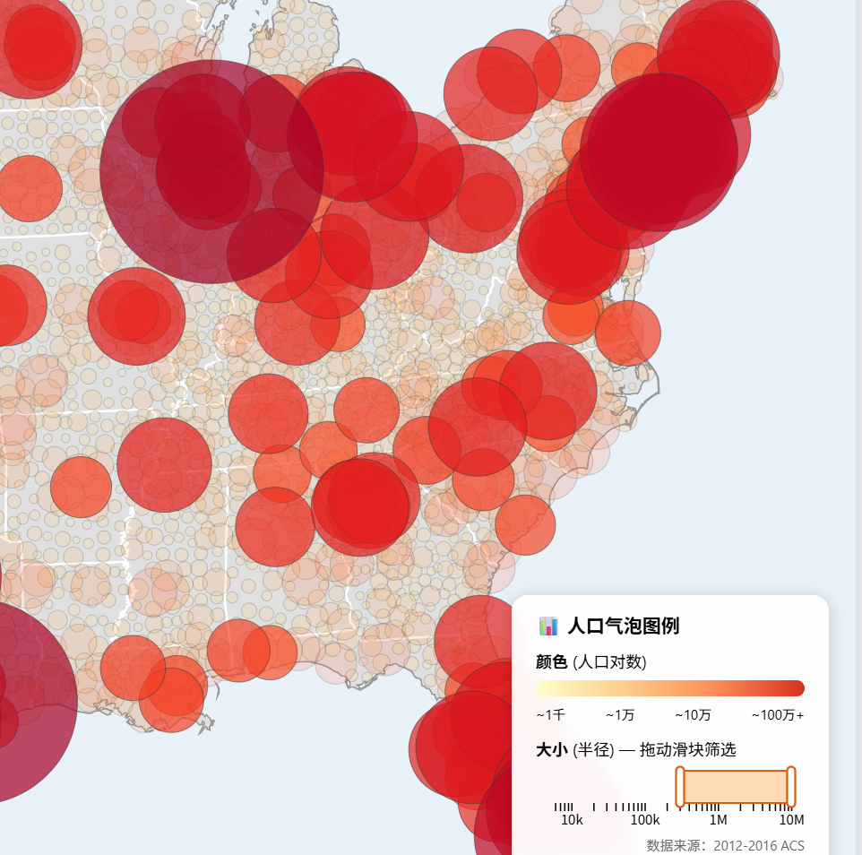

#### 💬 额外改进：反馈不直观 → 增强 tooltip

- **改进措施**：悬停时显示格式化后的县名、州名、人口数（如 `123,456`），并且 tooltip 跟随鼠标移动，气泡同时升至顶层加红边。  
- **代码模块**：`bubbles.js` 的 `detectHover()` 逆向射线检测 + `draw()` 最后单独绘制悬停气泡。  
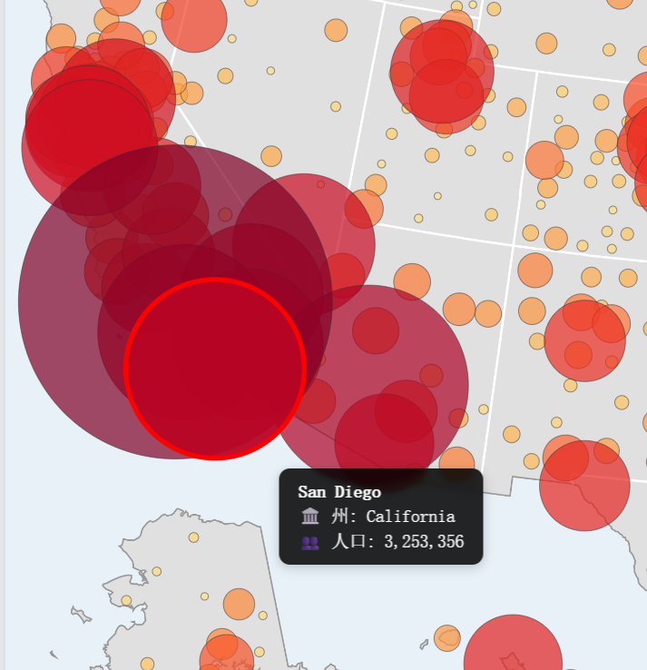

---

### 4.3 改进效果对比（非表格形式）

#### 交互能力
- **原始**：仅静态地图 + 悬停提示。

       
- **改进**：支持缩放、平移、州自动聚焦、人口刷选、图例联动。  
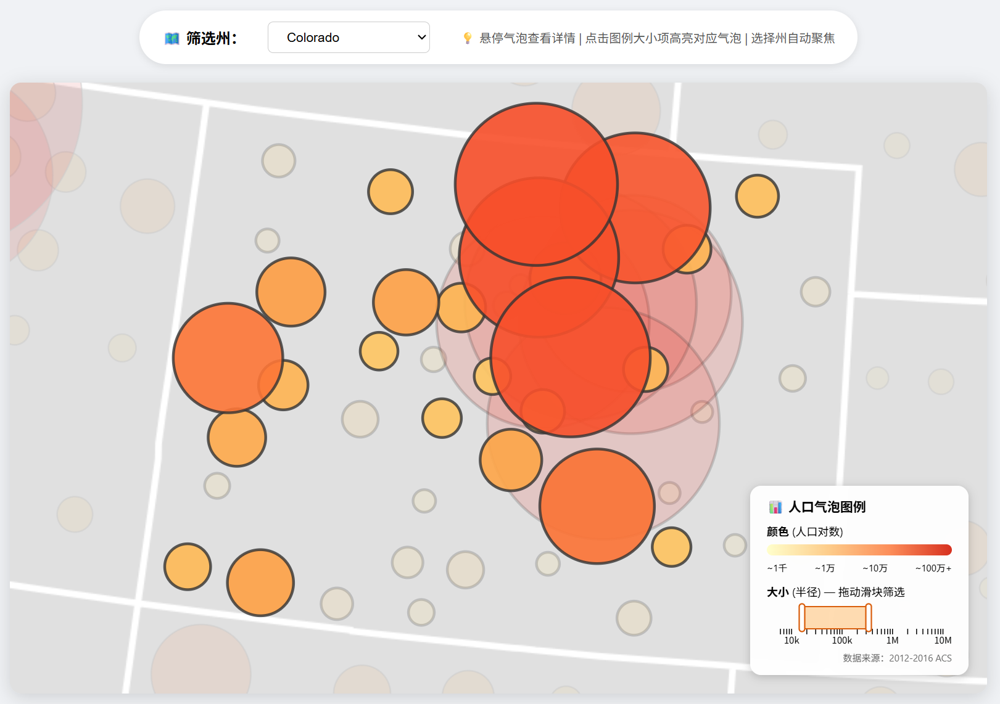

#### 颜色编码
- **原始**：单色棕色，无信息量。
  
- **改进**：黄→橙→红对数色标，直观反映人口量级。  

#### 前注意特征
- **原始**：无任何高亮/淡化引导。
  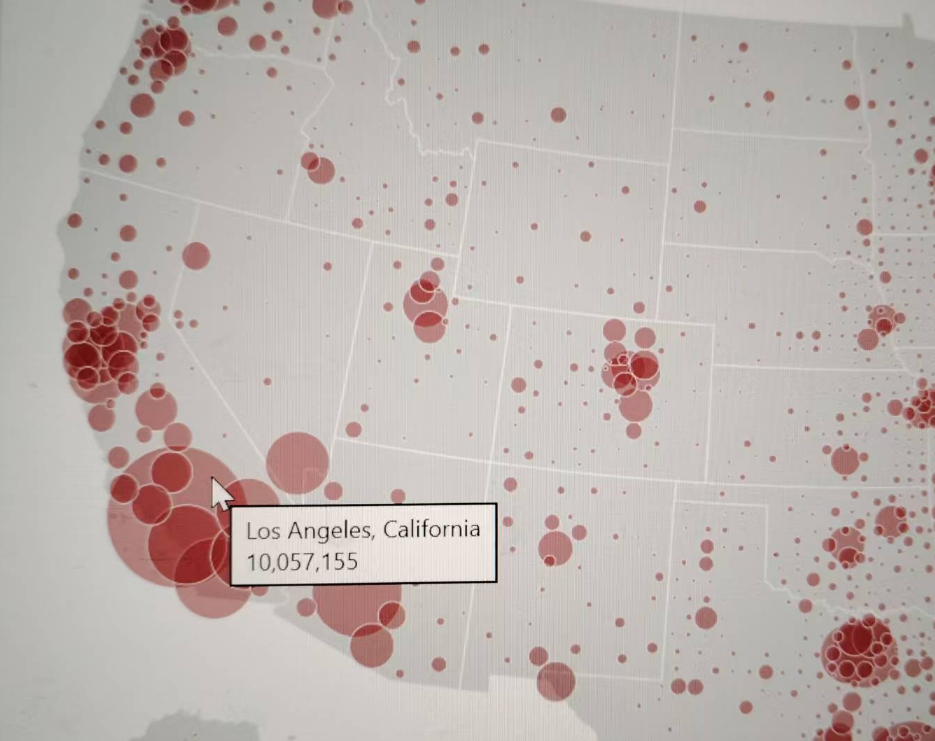
- **改进**：范围高亮、悬停红边、非目标州淡化，用户一眼可见感兴趣区域。  

#### 色盲支持
- **原始**：棕色对色盲用户几乎不可区分。
  
- **改进**：YlOrRd 亮度差异明显，色盲可辨识。  

---