# 改进图说明

> **小组成员**：卢仪曾、丁晨洋

---

## 一、Chart1：弦图（Chord Diagram）

> **原图来源**：<https://observablehq.com/@d3/chord-diagram>

### 原图存在的问题

原图使用 `d3.schemeCategory10` 调色板，颜色区分度在正常视觉下就已经勉强，到了色盲模式下更是灾难。用 Coblis 色盲模拟器测试，LG 的品红/粉色在红色盲视角下变为灰褐色，与 HTC 的灰色几乎无法区分；华为的亮绿变为芥末黄，索尼的深绿变为卡其色，与周围灰色弧段在色相上趋同，只能靠明度勉强区分。8% 的男性有色觉障碍，这个比例不低。

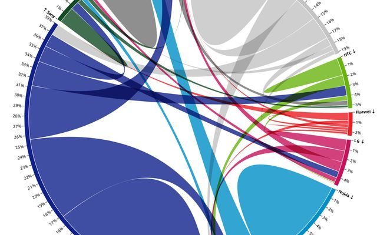

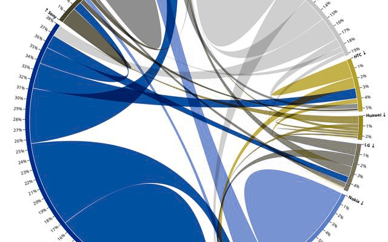

除了颜色问题，原图还存在几个结构性缺陷：品牌间迁移弧使用纯色填充，分不清是流入还是流出，长时间观看容易引发视觉疲劳；忠实用户用内圈自环表示，占据了内圈宝贵空间，与品牌间切换流混在一起，容易让人误以为这条粗弦也是品牌间迁移；想了解某个具体品牌时，原图信息粗略，需要逐个查找；流失用户在图上只有一个数字，看不到对应的视觉表达。当数据规模增大时，众多线条聚在一起，混乱难以阅读。

### 改进策略

替换为 `d3.schemeTableau10` 色盲安全调色板，7 个品牌色对比度更友好。对每个连接弧增加线性渐变填充，让用户一眼看出从哪个品牌切换到了哪个品牌，补强了原版缺失的方向编码。新增悬停弹出效应——悬停时淡化非相关品牌、强化目标品牌，颜色加深，更清晰地看出品牌之间的关系。

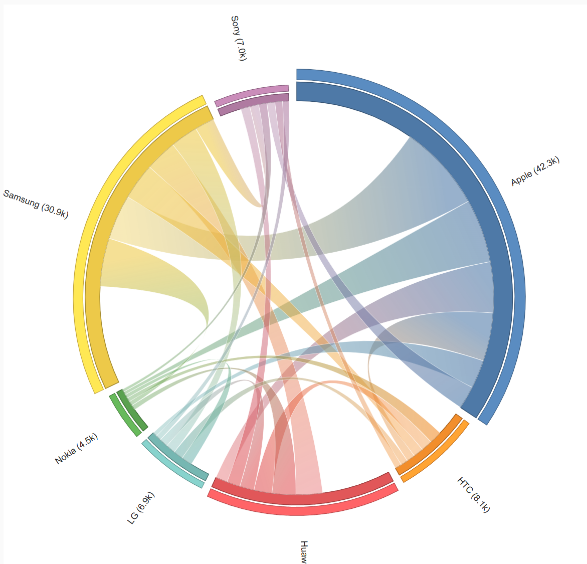

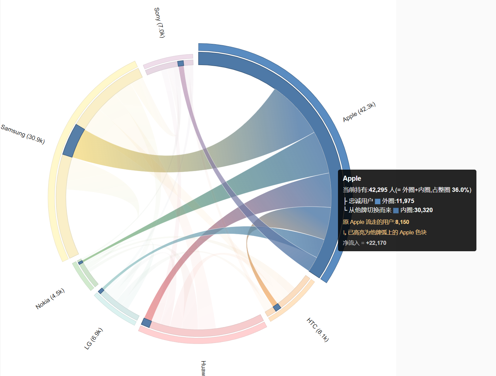

忠实用户从内圈自环改为外圈凸起：没换品牌的人往外凸起，换了品牌的人内部连线，两类数据用方向相反的视觉编码分离，不再有冗余的自环占据视觉空间。流失用户的可视表达也做了改进——在他牌弧的对应内弦段上覆盖一块本品牌色加深色描边的弧段，宽度精确等于 i → j 的人数。新增点击品牌进入详情页功能，整个 SVG 替换为该品牌的详情视图，显示总人数、忠诚用户、从他牌切换而来用户、流走用户等指标，并配有不同颜色高亮。

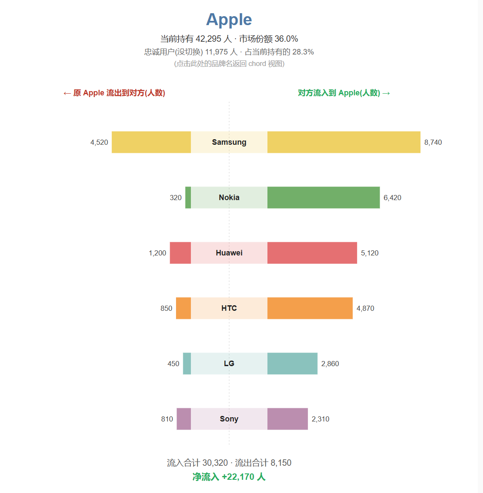

---

## 二、Chart2：旭日图（Zoomable Sunburst）

> **原图来源**：<https://observablehq.com/@d3/zoomable-sunburst>

### 原图存在的问题

原图使用彩虹色阶，红绿色盲用户几乎丧失所有颜色分组信息——鲜艳的颜色对色盲用户几乎不传递信息。下钻到子层级后，同层兄弟节点仍保留各自的原始颜色，这些颜色来自同一父级色系的微小变体，在放大视图中几乎无法区分，失去了"颜色=类别"的编码能力。面积感知也存在陷阱：Stevens 幂律（指数约 0.7）意味着两倍大的扇区看起来只大了约 70%，比较两个弧段的面积需要反复扫视。

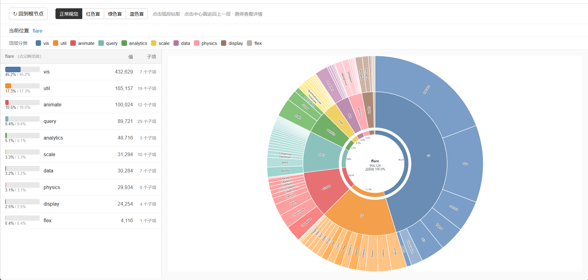

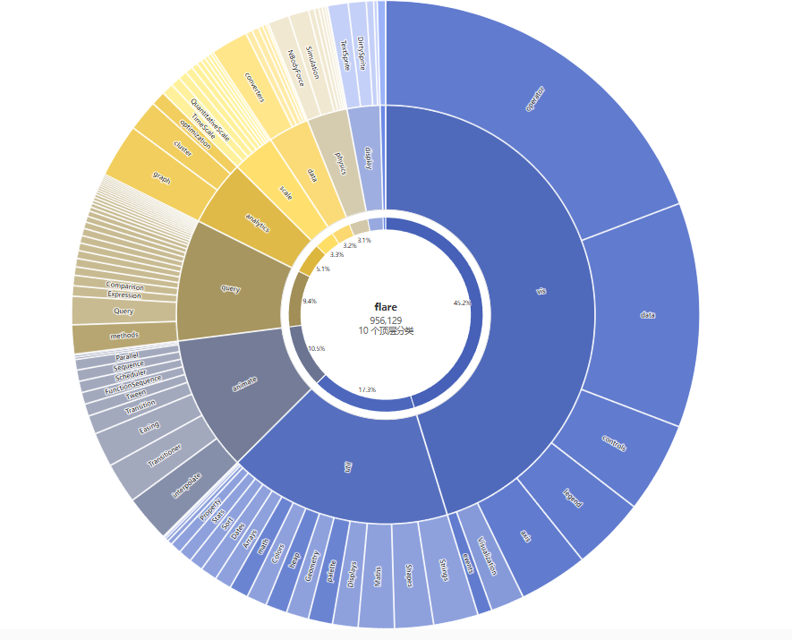

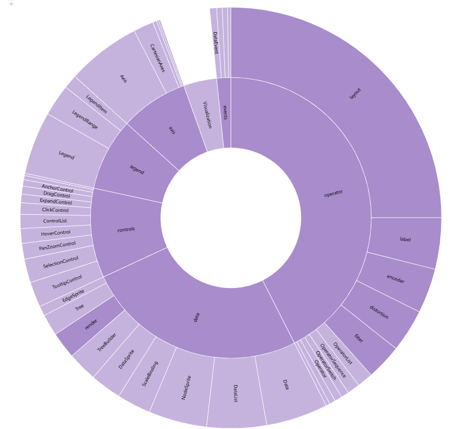

此外，钻取到深层后所有非聚焦节点从视图中消失，用户无法定位当前节点在全局中的位置；中心圆只作为点击返回的热区，信息空间被浪费；原始版本的 hover 反馈只有浏览器默认 title，内容仅包含路径和数值，信息量不足；弧段上的文字为纯黑色填充，叠加在深色或高饱和度的弧段上时对比度不足。

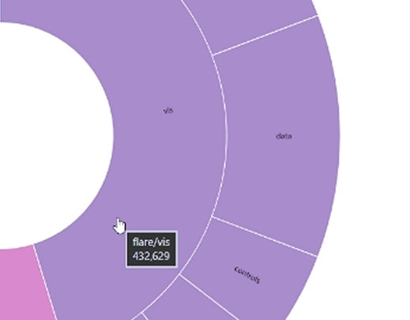

### 改进策略

换用 Tableau10 调色板，色相间距更大，对色盲更友好。每次钻取后以当前聚焦节点的直接子节点为单元重新分配色相，无论钻到多深，同级兄弟之间始终有足够的色相区分。

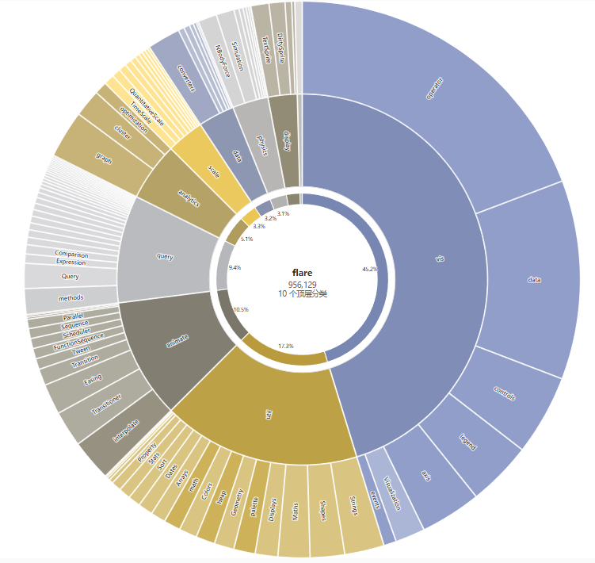

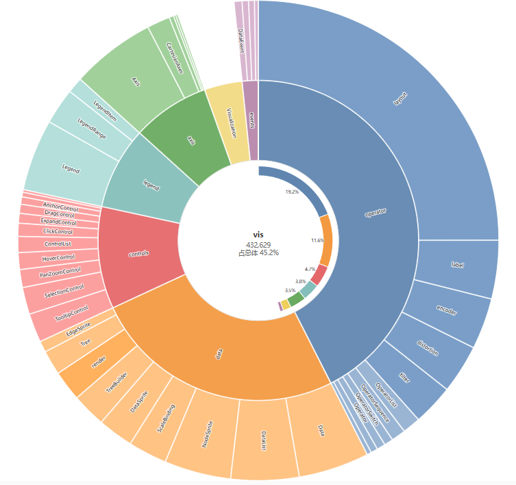

左侧新增文件管理器风格的表格，每个子项一行带彩色条形图，旁边标注精确数值和百分比。条形图的长度感知精度远高于弧段面积，表格行与右侧图表联动，点击也可触发钻取。顶部添加面包屑导航显示当前完整路径（根→A→B→C），每个路径节点可点击跳转。中心区域改为显示当前节点的名称、总数值、占整体百分比，外层添加百分比环形刻度条。

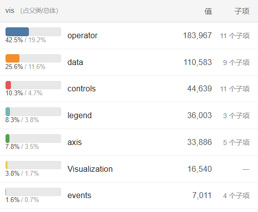

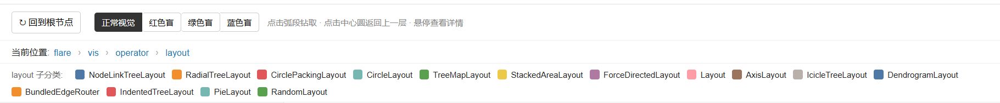

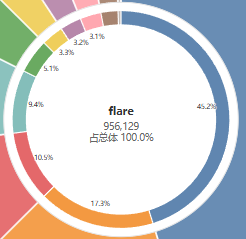

自定义 tooltip 替代了原生 title，单次悬停即可获取节点路径、数值、父级占比、整体占比、子项数量。弧段文字添加白色描边，使文字在任何颜色的弧段背景上都保持清晰可读。

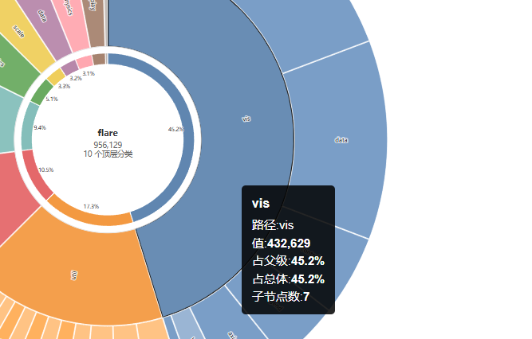

剩余局限：仍完全依赖颜色编码类别，严重色盲用户在三种滤镜下仍有可能颜色混淆。理想方案是叠加纹理或图标，但在小面积弧段的情况下无法呈现纹理细节。

---

## 三、Chart3：地震地图（QuakeSpotter）

> **原图来源**：<https://observablehq.com/@d3/world-earthquakes>

### 原图存在的问题

原图中所有地震点都是红色，无法区分震级大小——2.0 级和 2.9 级看起来完全一样，环太平洋地震带密密麻麻一片红，根本看不出差异。原图是静态的，不能旋转、不能缩放、不能点击查看单个地震的详情。打开页面看到一堆点，但"今天/本周地震多不多？""最大的有多大？"这些问题无法快速回答。

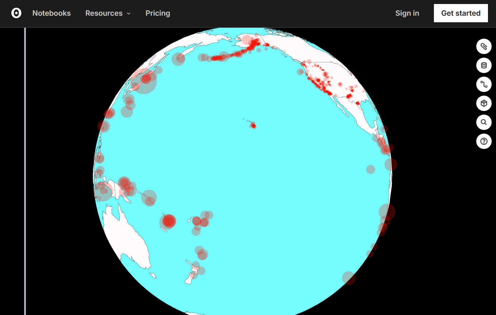

### 改进策略

第一步是按震级连续着色。震级是一个连续的数字，不应该用一个桶装所有人，改为让颜色也连续变化——小震是温和的颜色，大震是警示的颜色。随后叠加深度信息，浅层地震颜色鲜艳，深层地震颜色暗淡，颜色同时编码震级和深度两个变量。为每个圆点添加深色边框，防止相邻地震点融合成一片。

交互方面逐步迭代：添加悬停提示卡片显示震级、深度、位置、时间；添加顶部统计栏展示全局统计信息；实现点击聚焦——点击某个地震点后地图自动旋转并缩放到该位置；支持鼠标拖拽旋转地球，释放后按惯性继续旋转；添加缩放按钮支持远观全局和近看细节。首次加载时数据量大出现白屏，添加了加载进度指示器。

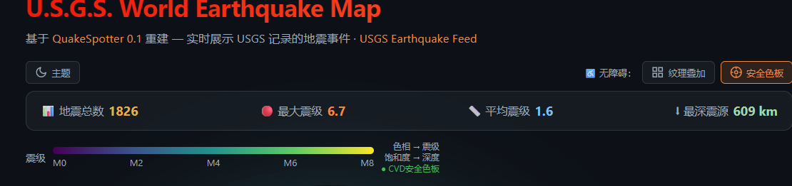

后续继续优化：替换为更高精度的国家边界数据，小国家也能清晰可见；重新设计整个配色方案确保色盲友好，用户可以自由选择开启安全色板；支持亮色和暗色两种主题切换；添加地图纹理细节，改进尺寸映射的精确度，增强相邻区域的颜色区分度，支持最高 10 倍缩放。

v0.4 版本修复了安全色板不能开关的 bug，修改了地震点的圆圈表示，震级越大颜色越深，鼠标悬停时出现黑色描边，点击时出现详细的信息卡片在右边。

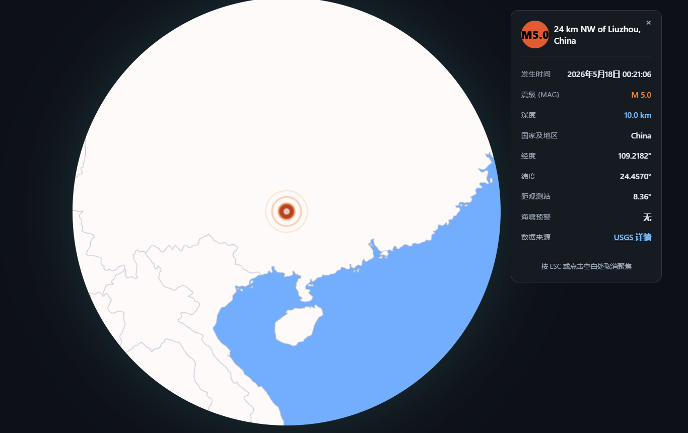

---

## 四、Chart4：气泡地图（Bubble Map）

> **原图来源**：<https://observablehq.com/@d3/bubble-map/2>

### 原图存在的问题

原图仅提供悬停提示，无法缩放、筛选、聚焦，人口密集区（如东海岸）气泡重叠严重，无法细致探索。所有气泡使用单一棕色，无法区分人口量级差异，只能依靠面积，且面积在重叠时难以比较。无高亮、淡化等引导，用户需逐个悬停才能获取信息。棕色对某些色盲人群接近不可见。无视口剔除，缩放/平移时重新绘制所有圆，高分辨率下掉帧。无法按州或人口范围快速过滤，分析任务受限。

### 改进策略

实现 D3 zoom 平移/缩放，支持平滑过渡与视口自适应。引入对数颜色映射（YlOrRd），颜色深度反映人口量级，该色标对红色-绿色色盲相对友好，亮度变化显著，符合"越红人口越多"的直观隐喻。增加刷选范围高亮——符合范围的气泡保持正常透明度，不符合者淡化，形成前注意分组；悬停时红色描边利用了颜色和形状的前注意弹出效果。

性能方面实现视口剔除，仅绘制当前视野内的气泡；使用双 Canvas（底图离屏预渲染加气泡动态层）减少重绘开销。添加州下拉菜单和人口范围刷选（D3 Brush），支持按行政区划和人口阈值动态过滤，选择某个州后地图自动平移并缩放到该州范围。自定义 tooltip 显示县名、州名、人口格式化，悬停时气泡升至顶层并增加红边。图例和控件采用响应式设计，支持移动端。

### 改进效果对比

| 维度 | 原始作品 | 改进作品 |
|------|----------|----------|
| 交互 | 静态 + 悬停 | 缩放/平移、刷选、下拉筛选、动态图例 |
| 颜色 | 单色（棕色） | 对数色标（黄→橙→红） |
| 前注意 | 无 | 范围高亮、悬停红边、非目标淡化 |
| 色盲支持 | 差 | 较好（YlOrRd 亮度变化） |
| 性能 | 全部重绘 | 视口剔除 + 离屏缓存 |
| 分析能力 | 仅浏览 | 支持区域聚焦、人口范围探索、多维度比较 |

---

## 五、总结

四个图表，四种类型，各自有不同的核心问题，但也有共性。色盲适配是反复出现的痛点——弦图换了调色板，旭日图换了调色板并在深钻时重新着色，地震地图重新设计了整个配色方案，气泡地图用了亮度变化显著的 YlOrRd 色阶。交互增强是所有图表的共同改进方向——悬停高亮、点击聚焦、缩放平移、刷选筛选，静态图表能展示数据，但只有交互式图表才能让用户探索数据。前注意特征的利用贯穿始终——颜色对比、亮度差异、描边高亮、透明度变化，都是为了让关键信息从视觉噪声中跳出来。

### 分工

卢仪曾、丁晨洋共同完成。

### 图表链接

| 图表 | 类型 | 原图链接 |
|------|------|----------|
| Chart1 | 弦图 | https://observablehq.com/@d3/chord-diagram |
| Chart2 | 旭日图 | https://observablehq.com/@d3/zoomable-sunburst |
| Chart3 | 地震地图 | https://observablehq.com/@d3/world-earthquakes |
| Chart4 | 气泡地图 | https://observablehq.com/@d3/bubble-map/2 |
